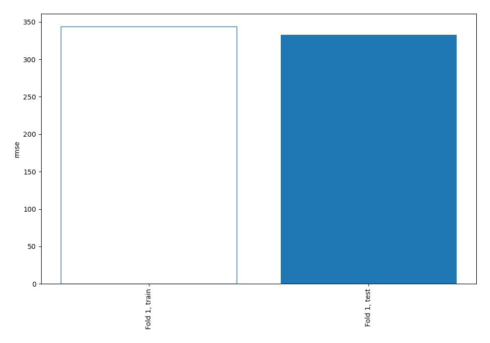
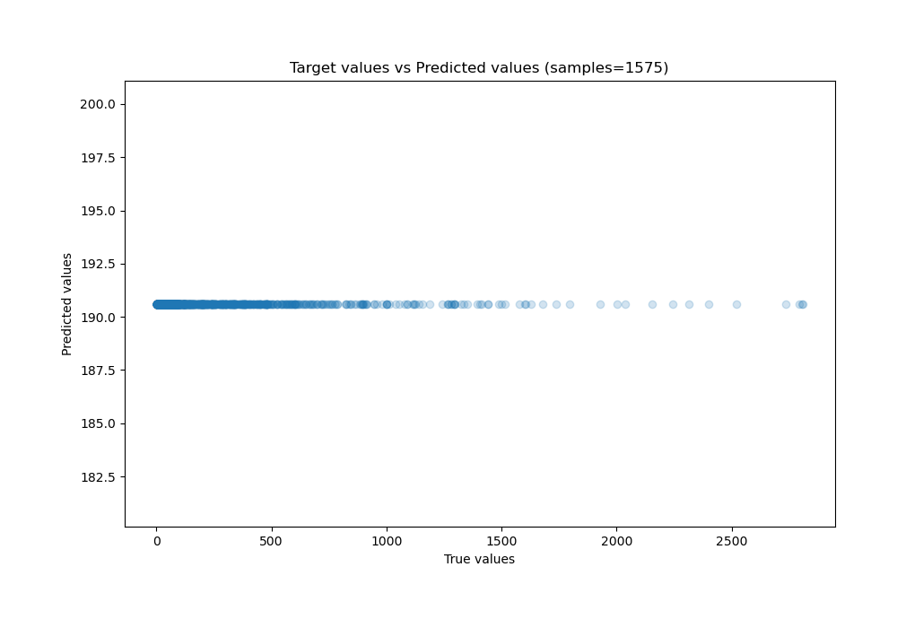

# Summary of 1_Baseline

[<< Go back](../README.md)

## Baseline Regressor (Baseline)
- **n_jobs**: -1
- **explain_level**: 2

## Validation
 - **validation_type**: split
 - **train_ratio**: 0.75
 - **shuffle**: True

## Optimized metric
rmse

## Training time

0.2 seconds

### Metric details:
| Metric   |            Score |
|:---------|-----------------:|
| MAE      |    205.193       |
| MSE      | 110804           |
| RMSE     |    332.872       |
| R2       |     -0.000274522 |
| MAPE     |      8.79663     |

## Learning curves

## True vs Predicted

## Predicted vs Residuals

[<< Go back](../README.md)
