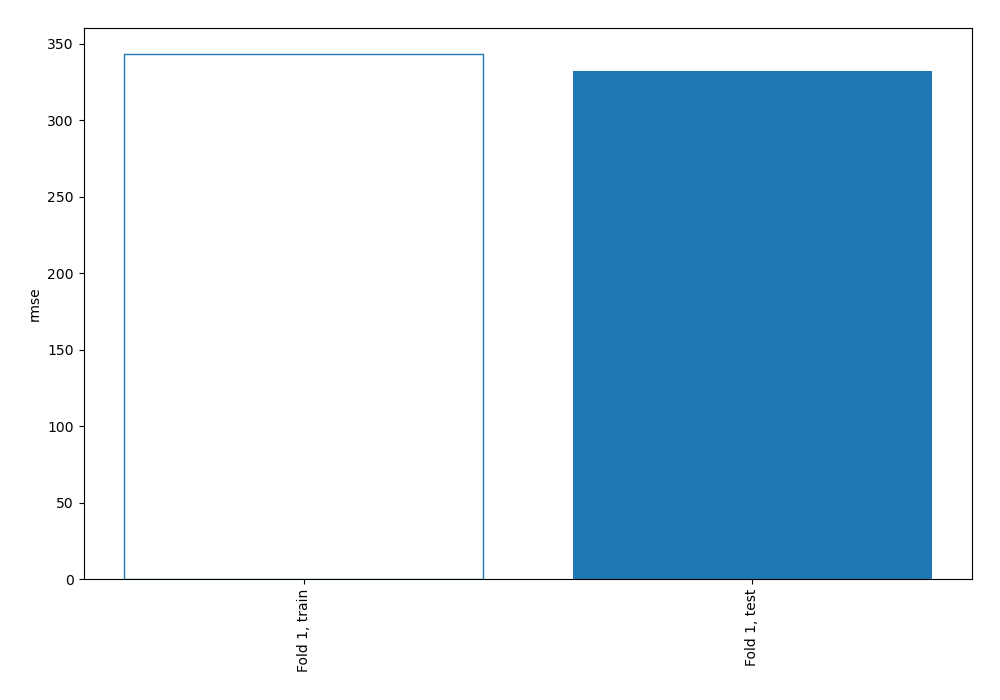
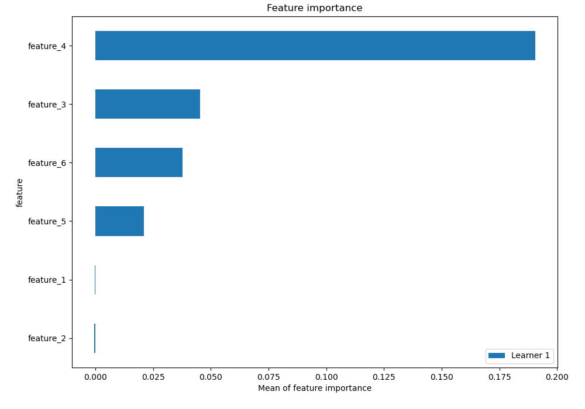
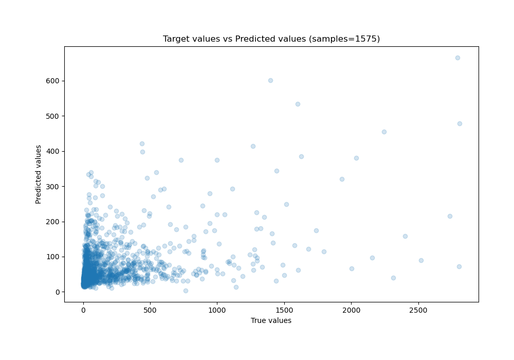
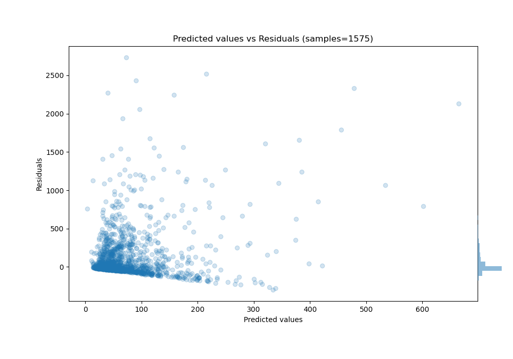
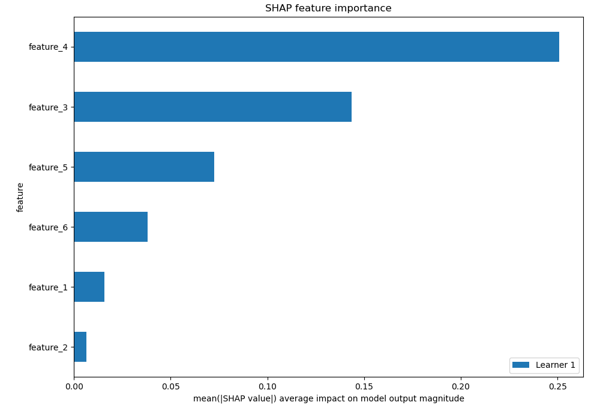
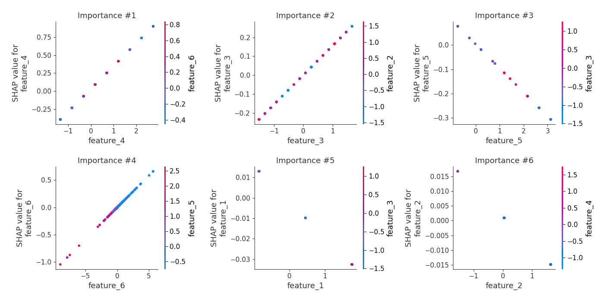
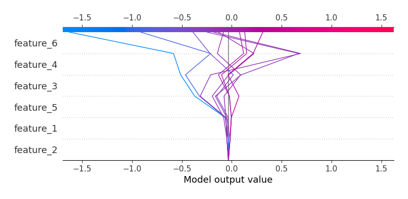
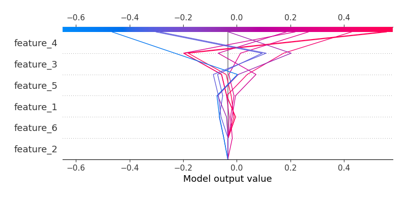

# Summary of 3_Linear

[<< Go back](../README.md)

## Linear Regression (Linear)
- **n_jobs**: -1
- **explain_level**: 2

## Validation
 - **validation_type**: split
 - **train_ratio**: 0.75
 - **shuffle**: True

## Optimized metric
rmse

## Training time

4.8 seconds

### Metric details:
| Metric   |           Score |
|:---------|----------------:|
| MAE      |    157.376      |
| MSE      | 110384          |
| RMSE     |    332.241      |
| R2       |      0.00351657 |
| MAPE     |      1.90159    |

## Learning curves

## Coefficients
| feature   |    Learner_1 |
|:----------|-------------:|
| feature_4 |  0.318094    |
| feature_3 |  0.155238    |
| feature_6 |  0.116386    |
| intercept | -0.000991016 |
| feature_2 | -0.00989321  |
| feature_1 | -0.0173204   |
| feature_5 | -0.0985397   |

## Permutation-based Importance

## True vs Predicted

## Predicted vs Residuals

## SHAP Importance

## SHAP Dependence plots

### Dependence (Fold 1)

## SHAP Decision plots

### Top-10 Worst decisions (Fold 1)

### Top-10 Best decisions (Fold 1)

[<< Go back](../README.md)
