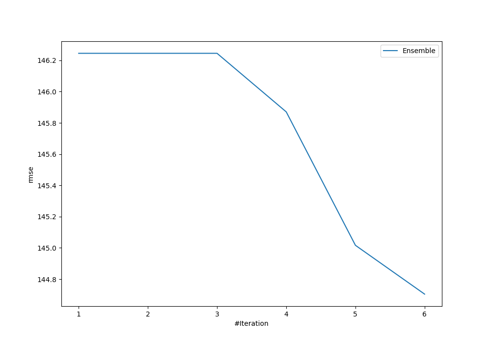
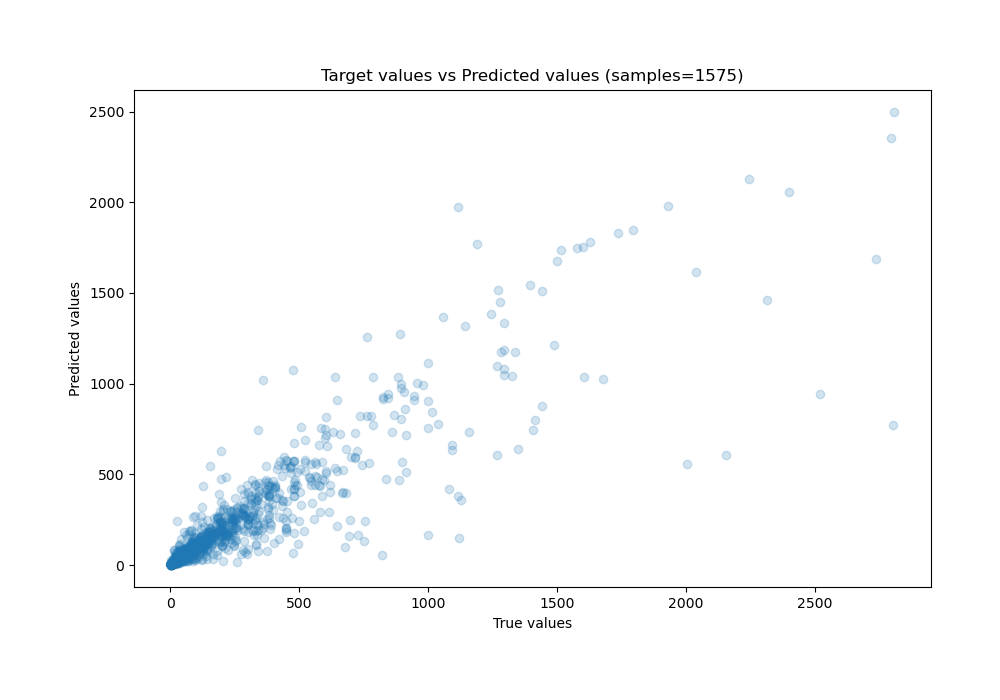
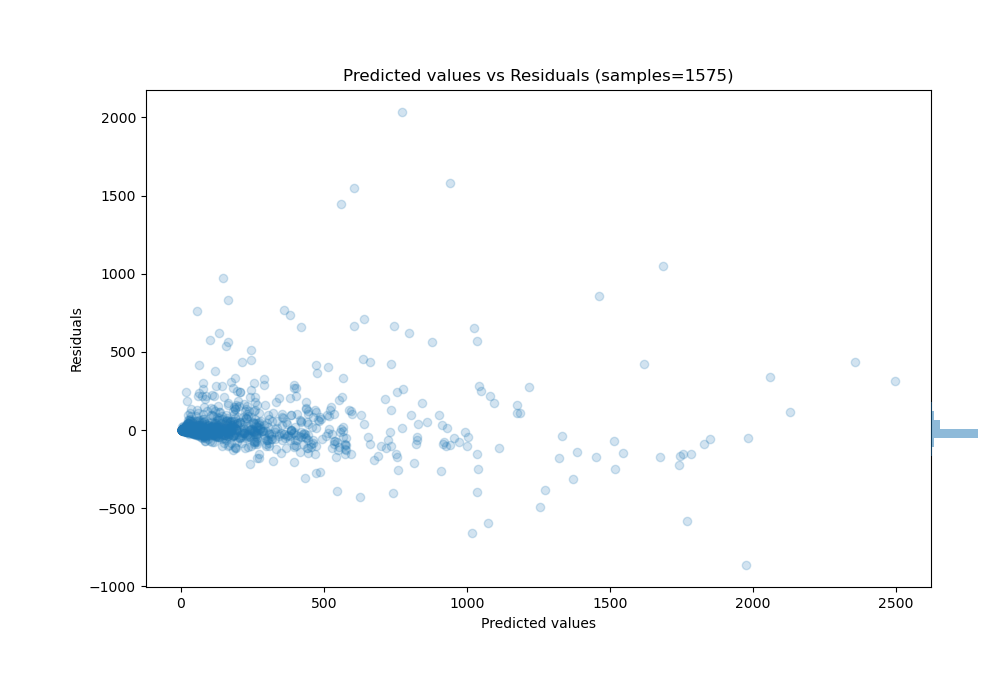

# Summary of Ensemble

[<< Go back](../README.md)

## Ensemble structure
| Model                   |   Weight |
|:------------------------|---------:|
| 4_Default_Xgboost       |        5 |
| 5_Default_NeuralNetwork |        1 |

### Metric details:
| Metric   |        Score |
|:---------|-------------:|
| MAE      |    51.7306   |
| MSE      | 20939.4      |
| RMSE     |   144.704    |
| R2       |     0.810972 |
| MAPE     |     0.27764  |

## Learning curves

## True vs Predicted

## Predicted vs Residuals

[<< Go back](../README.md)
